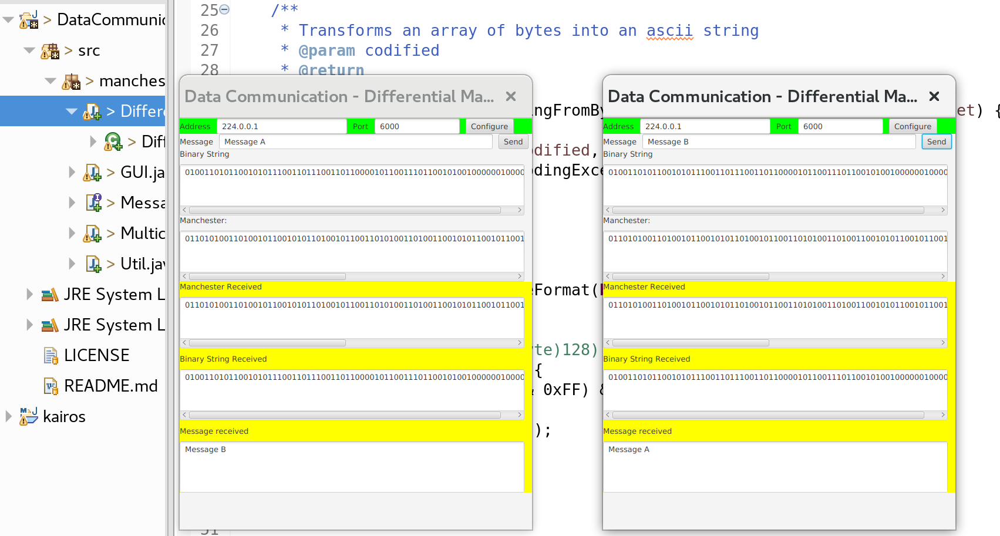

# DataCommunication
 The project contains the implementation of the Manchester Differential line code, a requirement of the UTFPR Data Communication class;
 
 

# Instructions

- Run the project and configure the IP Address and Port to be used.
- There must be at least 2 instances of the program executing in the same network and with the same address and port. 

A screenshot of the program execution is shown below.

